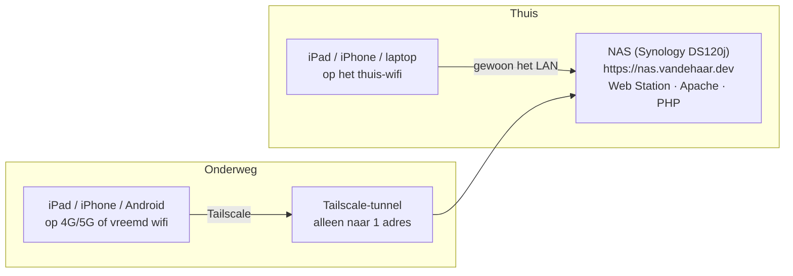

# rememberwhen

Een iPad-eerste, filmische herinneringsapp bovenop een vooraf samengestelde media-index. De bibliotheek wordt vooraf op een desktop samengesteld (de **Indexer**); de app speelt alleen af. Woordenlijst: [CONTEXT.md](CONTEXT.md).

Dit bestand is het **overzicht van alles wat er buiten de code is ingesteld**: de NAS, het certificaat, de login, het VPN. Het is bedoeld voor jezelf over een maand, als je vergeten bent hoe het ook alweer zat. De details staan in de runbooks en ADR's waarnaar hij verwijst.

## Het plaatje



Drie ideeën houden alles bij elkaar:

1. **Eén naam voor alles.** `nas.vandehaar.dev` wijst, in het openbare DNS, naar het *privé*-adres van de NAS. Thuis komt dat vanzelf goed uit. Van buiten het huis komt het verkeer via Tailscale precies bij datzelfde adres uit. De app, het certificaat en de login zien dus nooit een verschil tussen thuis en onderweg. ([ADR 0003](docs/adr/0003-public-dns-pointing-at-a-private-address.md), [ADR 0006](docs/adr/0006-remote-access-through-a-tailscale-route-to-the-nass-private-address.md))
2. **Geen enkele poort open naar buiten.** Niet voor het certificaat, niet voor het VPN. Alles gaat uitgaand vanaf de NAS.
3. **De app draait op de NAS zelf**, zodat app, catalogus en media dezelfde oorsprong hebben. Alleen dan neemt Safari een login mee naar `` en `<video>`. ([ADR 0004](docs/adr/0004-the-app-is-served-from-the-nas-so-the-media-is-same-site.md))

## De onderdelen

| Onderdeel | Wat het doet | Waar het zit | Meer |
| --- | --- | --- | --- |
| **DNS** | `nas.vandehaar.dev` → privé-adres van de NAS | Cloudflare (domein `vandehaar.dev`) | [runbook certificaat](docs/runbooks/nas-certificaat.md) |
| **Certificaat** | Echt HTTPS-certificaat (`*.vandehaar.dev`, Let's Encrypt) | acme.sh op de NAS, `/volume1/acme.sh` | [runbook certificaat](docs/runbooks/nas-certificaat.md) |
| **Webserver** | Levert de app, catalogus en media | Web Station op de NAS: Apache 2.4 + PHP | hieronder |
| **Login** | Per apparaat een sleutel in een cookie, 90 dagen | `.htaccess` + `enrol/` + `devices/` op de NAS | [runbook apparaten](docs/runbooks/apparaten.md), [ADR 0007](docs/adr/0007-each-device-carries-a-90-day-key-in-a-cookie.md) |
| **VPN** | Toegang van buiten het huis | Tailscale op de NAS en op elk apparaat | hieronder, [ADR 0006](docs/adr/0006-remote-access-through-a-tailscale-route-to-the-nass-private-address.md) |
| **Indexer** | Maakt de catalogus en de afgeleide media | .NET-programma op de desktop | [indexer/README.md](indexer/README.md) |
| **App** | De globe en de Stories | `frontend/` (React), gepubliceerd naar de NAS | [frontend/README.md](frontend/README.md) |

## De NAS

- **Model:** Synology DS120j (ARM, 512 MB, "opslag, geen rekenkracht"), DSM 7.4.1. Er is ruim 200 MB werkgeheugen vrij; Tailscale gebruikt er ongeveer 30.
- **Webserver:** Web Station → *Web Service* → *Default Service* → **HTTP back-end: Apache HTTP Server 2.4**, **PHP: Default Profile (PHP 8.2)**. Beide staan **aan** en moeten dat blijven: zonder Apache wordt `.htaccess` genegeerd (dan is er geen login), zonder PHP toont de aanmeldpagina haar eigen code als tekst. Apache draait 2.4.63 met `mod_rewrite` aan.
- **Webroot:** de gedeelde map `web`, op de NAS `/volume1/web`. Alles wat de site levert staat daar:

```text
/volume1/web/
├── .htaccess               de drempel (bron: nas/htaccess.template)
├── .htaccess.basic-backup  de oude Basic-drempel, voor als je terug wilt
├── index.html, assets/     de app (deploy-nas.ps1)
├── manifest.webmanifest    icoontjes, favicon, apple-touch-icon
├── catalog.json, media/    uitvoer van de Indexer
├── enrol/index.php         de aanmeldpagina
├── devices/                één bestand per gekoppeld apparaat
│   ├── .htaccess           "Require all denied": nooit via HTTP leverbaar
│   ├── .enrol-secret       hash van het huishoudwachtwoord (geen wachtwoord!)
│   ├── .enrol-attempts     teller tegen gokken
│   └── <43 tekens>         de sleutel van één apparaat
├── authspike/              oud experiment (#17), mag weg
└── .htpasswd-*             oude Basic-wachtwoorden, niet meer in gebruik, mogen weg
```

- **Het IP-adres van de NAS moet vastliggen.** Het openbare DNS-record wijst ernaar. Verandert het adres, dan breekt de app zonder foutmelding. Controleer in de router dat er een DHCP-reservering voor staat ([ADR 0003](docs/adr/0003-public-dns-pointing-at-a-private-address.md)).
- **SSH** staat aan, met een sleutelpaar voor de deploy-scripts: de privésleutel staat op de PC in `%USERPROFILE%\.ssh\rememberwhen_nas_ed25519`. `scp` moet met `-O` (het SFTP-subsysteem staat uit).

## Het certificaat

Kort: een echt wildcard-certificaat, zonder dat er een poort open hoeft. acme.sh op de NAS haalt het via een **DNS-uitdaging** bij Cloudflare op; een dagelijkse taak in de DSM-Taakplanner (03:15, als root) vernieuwt het. Het openbare A-record wijst bewust naar het privé-adres, zodat het certificaat geldig is maar de naam alleen binnen komt.

**Wanneer zie je iets:** vernieuwing rond **27 oktober 2026** (verloopt pas 27 november); het domein verlengt rond **29 augustus** vanzelf.

Alles verder (waarom dit en niet DSM's eigen knop, de controles, wat te doen als het misgaat, opnieuw opbouwen): [docs/runbooks/nas-certificaat.md](docs/runbooks/nas-certificaat.md).

## De login: een sleutel per apparaat

Basic-auth vergat het wachtwoord zodra de app dicht ging, en de kinderen kunnen het niet typen. Nu:

- Elk apparaat heeft een eigen lange, willekeurige **sleutel**, bewaard als **cookie** (`HttpOnly`, `Secure`, 90 dagen, begint opnieuw bij elk gebruik).
- De drempel is één `.htaccess` (`mod_rewrite`): een verzoek komt alleen door als er in `devices/` een bestand bestaat met de naam uit de cookie. Geen PHP per verzoek, geen wachtwoord-hash per foto.
- **Koppelen** doe je één keer per apparaat, **in de geïnstalleerde app**, op `/enrol/`: huishoudwachtwoord + naam van het apparaat. De kinderen typen nooit iets.
- **Intrekken** = het bestand van dat apparaat in `devices/` verwijderen (en het apparaat in Tailscale weghalen).
- De 90 dagen worden vernieuwd op `catalog.json`, het ene verzoek dat elke start van de app doet. Daarom staat in `frontend/src/App.tsx` `cache: 'no-store'` op die fetch: haal dat niet weg.

Installeren of vervangen: `pwsh ./deploy-auth.ps1` (`-ChoosePassword` om het huishoudwachtwoord zelf te kiezen). Stap voor stap, inclusief een apparaat koppelen en intrekken: [docs/runbooks/apparaten.md](docs/runbooks/apparaten.md).

Dingen die je anders vergeet:

- **Zet de app op het beginscherm en koppel binnen die app.** De geïnstalleerde app heeft een eigen cookie-opslag, los van Safari; een sleutel uit een Safari-tabblad bereikt hem niet.
- **Een `.htaccess` in een submap** die zelf `RewriteEngine On` zegt, vervangt de drempel voor die map, tenzij er ook `RewriteOptions Inherit` staat.
- **Nooit `<IfModule mod_rewrite.c>` om de drempel.** Ontbreekt de module dan hoort de site luid te falen (500), niet stil open te gaan.
- **Geen `credentials: 'omit'`** op fetches in de app.
- Terugdraaien naar de oude login: op de NAS `cp /volume1/web/.htaccess.basic-backup /volume1/web/.htaccess`.

## Van buiten het huis: Tailscale

Tailscale is een VPN dat geen poort nodig heeft. Op de NAS staat het als officieel pakket (Package Center, versie 1.58.2), ingelogd onder **één Tailscale-account** (je Apple-account). Elk apparaat dat van buiten moet komen krijgt de Tailscale-app en logt in onder datzelfde account.

**De NAS als "subnet router" voor precies één adres.** De NAS adverteert alleen een route naar zijn eigen LAN-adres (`/32`), niets anders van het thuisnetwerk. Een apparaat onderweg vraagt het openbare DNS naar `nas.vandehaar.dev`, krijgt het privé-adres, en het verkeer gaat door de tunnel. Zo blijft het dezelfde oorsprong, hetzelfde certificaat en dezelfde login.

Wat er is ingesteld (en wat je opnieuw moet doen als je het ooit opnieuw opbouwt):

1. Tailscale installeren uit Package Center en inloggen.
2. In de Tailscale-beheerpagina ([login.tailscale.com/admin/machines](https://login.tailscale.com/admin/machines)): bij de NAS **key expiry uitzetten**, anders valt het na 180 dagen stil weg.
3. Op de NAS (SSH, met `sudo`, het pakket draait zonder rechten):
   `sudo /var/packages/Tailscale/target/bin/tailscale set --advertise-routes=<adres-van-de-NAS>/32`
4. In de beheerpagina de route bij de NAS **goedkeuren** ("Edit route settings").
5. Per apparaat: Tailscale-app, inloggen, en **key expiry uitzetten** in de beheerpagina.

**Kinderen doen niets.** Stel het één keer in door een volwassene:

- **iPad / iPhone:** in de Tailscale-app de instelling *VPN On Demand* (te vinden in de instellingen van de app): Wi-Fi = **verbinden behalve op het thuis-wifi** (SSID toevoegen), mobiel = altijd aan. Thuis is de VPN dan uit, en de app hangt er thuis nooit van af.
- **Android:** *Instellingen → Netwerk → VPN → Altijd-aan VPN* (met Tailscale).
- **Laptop:** Tailscale aan- of uitzetten met de hand; hij gebruikt ook het VPN van je werk en je wilt nooit beide tegelijk.

Waarom Tailscale en niet de alternatieven (Cloudflare Tunnel, Synology VPN Server, WireGuard, ZeroTier): [ADR 0006](docs/adr/0006-remote-access-through-a-tailscale-route-to-the-nass-private-address.md) en [docs/research/remote-access-on-a-ds120j.md](docs/research/remote-access-on-a-ds120j.md).

## Nieuwe versie van de app of nieuwe Memories publiceren

- **App (frontend):** `pwsh ./deploy-nas.ps1` bouwt `frontend/` en zet het in `/volume1/web`. Dit raakt de drempel, `enrol/` en `devices/` niet aan.
- **Nieuwe of aangepaste Memories:** in de Indexer-UI op **Publiceren**; die roept hetzelfde script aan met alleen de gewijzigde bestanden. De uitvoer van de Indexer landt in een aparte share en komt alleen live door die stap.
- **De drempel zelf:** `pwsh ./deploy-auth.ps1`. Alleen nodig als `nas/` verandert.

## Wat is bewezen en wat nog niet

Bewezen, op de eigen apparaten ([issue #56](https://github.com/marcovandehaar/rememberwhen/issues/56)):

- De sleutel blijft na het geforceerd afsluiten van de geïnstalleerde app en na een herstart van de iPad.
- Een apparaat buitensluiten door het bestand te verwijderen werkt direct.
- De iPhone op 5G (wifi uit, Tailscale aan) bereikt de NAS onder dezelfde naam, en speelt een video van 20 MB af, inclusief terugspoelen.
- De NAS heeft met Tailscale genoeg geheugen over.

**Nog niet gedaan of getest, in volgorde van belang:**

1. **Tailscale op de iPads van de kinderen**, met *VPN On Demand* (zie hierboven), en key expiry uit op elk apparaat.
2. **De overlap-valkuil.** Het thuisnetwerk zit op `192.168.0.x`, een van de meest gebruikte reeksen. Staat de iPad op een vreemd wifi met dezelfde reeks, dan stuurt iOS het verkeer niet door de tunnel en faalt de toegang. Zie je dat ooit, verhuis dan het thuisnetwerk naar een ongewone reeks en werk het DNS-record één keer bij ([research](docs/research/remote-access-on-a-ds120j.md)).
3. **Split-DNS in Tailscale** voor `vandehaar.dev`, voor netwerken die DNS-antwoorden met privé-adressen weggooien (DNS rebinding protection).
4. **Android thuis** met Altijd-aan VPN: neemt het verkeer het LAN of de tunnel, en werkt de app als Tailscale op de NAS stilstaat?
5. **Opruimen:** `authspike/` en de `.htpasswd-*`-bestanden op de NAS.

## Als het stuk is

| Wat je ziet | Waarschijnlijke oorzaak | Doe dit |
| --- | --- | --- |
| Thuis: de site laadt niet | NAS uit, of het IP-adres is verschoven | Is de NAS aan? Wijst `nas.vandehaar.dev` nog naar het juiste adres (runbook certificaat)? |
| Thuis: certificaatwaarschuwing | Certificaat niet vernieuwd | [Runbook certificaat](docs/runbooks/nas-certificaat.md), "Als het misgaat" |
| Onderweg: niets laadt | Tailscale staat uit, of de route is niet goedgekeurd, of overlappende reeks | Staat Tailscale aan op het apparaat? Route goedgekeurd? Zie "overlap-valkuil" |
| Onderweg werkte het, nu niet meer | Key expiry (na 180 dagen) | Opnieuw inloggen op dat apparaat en key expiry uitzetten |
| Eén apparaat krijgt de aanmeldpagina | 90 dagen ongebruikt, gewist, of ingetrokken | Opnieuw koppelen ([runbook apparaten](docs/runbooks/apparaten.md)) |
| Iedereen krijgt de aanmeldpagina of een 403 | `.htaccess` stuk of weg | `.htaccess.basic-backup` terugzetten, zoek dan de oorzaak |
| Alles geeft een 500 | `mod_rewrite` niet geladen (na een Apache-update) | Bedoeld gedrag: luid falen. Module weer aan, de drempel niet omzeilen |
| De aanmeldpagina toont code als tekst | PHP staat uit voor de site | Web Station → Default Service → PHP: een profiel kiezen |
| "Te veel pogingen" | 8 verkeerde wachtwoorden | Een kwartier wachten, of `devices/.enrol-attempts` verwijderen |

## Waar zitten de geheimen

Er staan **geen geheimen in deze repo**. Waar ze wél zitten:

| Geheim | Plek |
| --- | --- |
| Cloudflare-token (alleen DNS-rechten voor deze zone) | `/volume1/acme.sh/account.conf` op de NAS, map op `700` |
| Huishoudwachtwoord | Jouw wachtwoordmanager; op de NAS alleen de hash in `devices/.enrol-secret` |
| Sleutel per apparaat | Als cookie op dat apparaat; het bestand in `devices/` op de NAS |
| SSH-sleutel voor de deploys | `%USERPROFILE%\.ssh\rememberwhen_nas_ed25519` op de PC |
| Tailscale | Je Apple-account; geen wachtwoord of token in de repo |

Twee e-mailadressen houden het certificaat en het domein in leven: het **iCloud-adres** (registrant bij Cloudflare) en het **Synology-account** (DSM meldt `Certificate error`). Zie het runbook certificaat.

## Waar vind je wat

- **Waarom het zo is:** [docs/adr/](docs/adr/). 0003 DNS en certificaat, 0004 de app op de NAS, 0006 Tailscale, 0007 de sleutel in een cookie.
- **Hoe je het doet:** [docs/runbooks/](docs/runbooks/). Certificaat, apparaten koppelen en intrekken.
- **Wat is uitgezocht:** [docs/research/](docs/research/). Brononderzoek achter de keuzes, inclusief wat bewezen is en wat niet.
- **Wat is gemeten op de iPad:** [issue #56](https://github.com/marcovandehaar/rememberwhen/issues/56) (login en VPN), [issue #17](https://github.com/marcovandehaar/rememberwhen/issues/17) (de eerdere Basic-metingen).
- **Hoe dit besloten is:** [issue #51](https://github.com/marcovandehaar/rememberwhen/issues/51), de kaart "Stay logged in, and reach it from outside".
- **Wat de app moet doen:** [docs/v1-build-spec.md](docs/v1-build-spec.md).

## Alles opnieuw opbouwen, in volgorde

1. Cloudflare: het A-record `nas.vandehaar.dev` → privé-adres van de NAS, **DNS only**; en een DHCP-reservering in de router voor dat adres.
2. Het certificaat: [runbook certificaat](docs/runbooks/nas-certificaat.md).
3. Web Station: Default Service op **Apache 2.4**, PHP-profiel gekozen; de map `web` als webroot.
4. SSH-sleutel voor de deploys; `pwsh ./deploy-nas.ps1` voor de app; de Indexer-UI voor de Memories.
5. `pwsh ./deploy-auth.ps1 -ChoosePassword` voor de drempel.
6. Tailscale op de NAS, de `/32`-route, goedkeuren, key expiry uit.
7. Per apparaat: Tailscale (met On Demand of Altijd-aan), de app op het beginscherm, koppelen.
